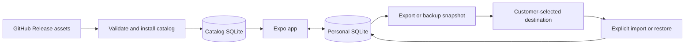

# Client-only Gramello: native scope

Date: 2026-09-22
Status: Approved for native implementation; browser work explicitly excluded

## Product outcome

Sell Gramello as a one-time purchase on iOS and Android. Each installation keeps its own data in SQLite and works without a Gramello account or a Gramello-operated API. GitHub Releases distribute public food catalogs, which download and update automatically without requiring customer attention. Settings also provides a “Check for updates” action. Customers can export their personal data to a destination they choose and import it on another device.

**Confirmed boundary: one active device.** Automatic synchronization between devices is not required. Moving data between devices is a deliberate manual export/import operation. If someone uses two installations independently, their diaries remain independent.

Backup is user-directed file export. Gramello creates a local archive and presents the operating system's save/share interface; the customer chooses whether to keep it locally or send it to iCloud Drive, Google Drive, or another available destination. Direct cloud-provider integrations and automatic uploads of personal data are outside this scope. “Client-only” means no application backend that we operate; GitHub and app stores remain external services.

## Recommended architecture

Keep the existing Expo / React Native application. Separate replaceable food catalogs from the customer's personal database.

Use `expo-sqlite`, which supports persisted iOS/Android databases, bundled database imports, full-text search, and a database backup API. Select the SDK-compatible package during implementation. [Expo SQLite documentation](https://docs.expo.dev/versions/latest/sdk/sqlite/)

| Store | Contents | Update behavior |
| --- | --- | --- |
| Catalog database(s) | Published food records, serving information, barcode index, provenance, source dates, search indexes | Read-only after installation; replace with validated releases |
| Personal database | Diary, goals, hydration entries, custom foods, saved recipes, preferences | Local transactional writes; explicit backup/export and restore/import |

Preserve nutrition and serving snapshots in diary entries and recipe ingredients. A refreshed catalog, removed food, or different catalog version on the destination device must not alter historical totals or break saved recipes.

Use app-shipped migrations for personal data and a separate catalog schema version. No sync engine, mutation outbox, change log, tombstone protocol, or conflict resolution system is needed.

## What the repository already provides

| Area | Current state | Scope of change |
| --- | --- | --- |
| Native UI | Expo 57; diary, trends, goals, recipes, water, camera scanning | Retain screens; remove sign-in dependency |
| Persistence | SQLite schema, but queries use server-side Cloudflare D1 bindings | Port query execution and migrations to device SQLite |
| Mobile data access | `useSession().api` and HTTP route strings | Replace with typed local repositories and refresh after local writes |
| Nutrition rules | Shared serving, weight, volume, and recipe calculations | Reuse; move remaining route-level validation into shared services |
| Food discovery | Server combines local restaurants, USDA API, and Open Food Facts | Local catalog search/barcode index; optional online lookup considered separately |

Relevant files: [mobile entry point](../mobile/App.tsx), [HTTP client](../mobile/src/lib/api.ts), [schema](../db/schema.ts), [diary queries](../db/store.ts), [food queries](../db/foods.ts), [food search route](../app/api/foods/search/route.ts), [portion rules](../lib/food.ts), and [recipe rules](../lib/meals.ts).

Custom foods become private to the installation instead of being published into today's shared catalog. Source labels identify provenance; the local app should not retain claims that server validation protects locally editable data from tampering.

The checked-in [restaurant import summary](restaurant-import/import-summary.json) contains **42,529 foods across 150 catalogs**. Of those catalogs, **102 list Nutritionix** and **48 list official restaurant nutrition** as their source. Restaurant JSON files occupy approximately 11.1 MB before conversion; that is not a measurement of the proposed SQLite database or a complete grocery catalog.

This is mainly a persistence migration and catalog/export project. The existing interface and nutrition calculations are useful foundations.

## GitHub catalog distribution

Use the existing public repository with a dedicated `food-catalog` prerelease so food releases advance independently of app versions. A dedicated public data repository can be substituted later. Publish actual Release assets, not expiring Actions build artifacts. Downloads must not require a GitHub token. Catalogs will be publicly downloadable; the paid product is the application and its experience.

GitHub currently permits individual release assets under 2 GiB and documents no aggregate release-size or release-bandwidth limit. This is suitable for an initial distribution mechanism, but is not an availability guarantee. Keep the download origin configurable for a future mirror. [GitHub release limits](https://docs.github.com/en/repositories/releasing-projects-on-github/about-releases)

1. Build normalized, indexed SQLite packs in CI from explicitly approved sources. Produce source/license notices alongside the data.
2. Publish versioned SQLite packs and a signed manifest containing compatibility information, immutable asset URLs, byte sizes, record counts, and hashes. The initial 4.9 MB pack is uncompressed to avoid a decompression dependency.
3. Bundle a useful starter pack produced by the same pipeline. First launch and basic logging work offline; the current compatible catalog downloads automatically afterward. No download/setup decision is required.
4. Check automatically on first launch and on app resume when the previous successful check is at least 24 hours old, with jitter and failure backoff. Settings “Check for updates” bypasses that check interval. Stage downloads, check available space, verify signature/hash/schema/integrity, and activate only a complete compatible database.
5. Preserve the installed catalog on interruption, corruption, incompatibility, or GitHub outage. Retry automatically when conditions allow. Catalog installation must never replace the personal database.

**Customer experience:** routine checks, downloads, and successful installations are silent and do not block diary use or ask for approval. Settings can show catalog date, last check, an in-progress download, and the result of a manual check. Persistent failures are inspectable there without repeated interruption. The manual action checks and installs available compatible updates; it does not merely announce them and require another decision.

Use opportunistic background execution where practical, but guarantee catch-up when the app next runs rather than promising updates while the OS has suspended it. Automatic updates do not depend on enabling personal-data backup. If packs are split internally, the app chooses the supported launch set; pack selection is not required onboarding. Measure download sizes and choose a compact default catalog so automatic delivery remains reasonable on mobile connections.

Use direct release download URLs for manifests and assets rather than calling the GitHub REST API on every launch. Unauthenticated REST requests share a 60-per-hour limit per originating IP. [GitHub API rate limits](https://docs.github.com/en/rest/using-the-rest-api/rate-limits-for-the-rest-api)

Start with full pack replacement and retain the previous working version through activation. Add delta updates only if measured download sizes justify the complexity. Benchmark branded-food coverage before selecting pack boundaries; the restaurant dataset is not a proxy for a national grocery database. Keep images outside the first offline pack unless they are a clear product requirement.

### Data rights and coverage

USDA FoodData Central is a strong starting source: USDA publishes its data as public domain under CC0. Build from downloadable datasets so runtime API keys and API availability do not determine whether the app works. [USDA licensing](https://fdc.nal.usda.gov/api-guide/)

Open Food Facts can expand barcode coverage, but its database uses ODbL, with separate terms for individual contents and images. Attribute it and resolve obligations for distributing adapted or combined databases before publishing packs. Separate packs may help organization, but a file boundary alone does not establish compliance. [Open Food Facts developer documentation](https://openfoodfacts.github.io/documentation/docs/Product-Opener/api/)

The repository's Nutritionix and restaurant-source provenance does **not** establish commercial redistribution permission. Audit rights source by source; exclude uncleared material from distributable packs. This scope does not conclude that the current imports are licensed or prohibited.

Offline barcodes can only match installed data. Unknown codes should offer a custom-food flow. Optional direct online lookup may improve coverage, but needs separate provider-terms and rate-limit review and must not be necessary to log a meal. Never embed a shared secret API credential in the app.

## Portable export and import: launch requirement

Offer two formats:

- A versioned `.gramello` archive containing documented JSON for the complete personal dataset. Include diary nutrition snapshots, recipe ingredients, custom foods, hydration, goals, preferences, and format metadata. This is the restorable backup.
- CSV exports for diary/water history, suitable for spreadsheets and use outside Gramello. CSV is not the complete-fidelity restore format.

Exclude credentials and downloadable catalogs. An archive should restore useful history without needing the exact catalog release that originally produced it. Manual import between iOS and Android is in scope.

Use iOS document export/share and Android's Storage Access Framework to offer local files and storage providers exposed by the operating system. This lets customers select destinations without building a separate integration for every cloud service. [Apple document export](https://developer.apple.com/documentation/uikit/uidocumentpickerviewcontroller), [Android document storage](https://developer.android.com/training/data-storage/shared/documents-files)

Create exports from a consistent snapshot using SQLite's backup API or a transactionally consistent logical export. Do not copy an actively written SQLite file and assume it contains pending WAL changes.

Import validates the format, version, and contents before changing live data. Show the backup date and record counts, make a recovery snapshot of the current diary, and explicitly replace local personal data after confirmation. Use a transaction or staged database activation so interruption does not leave a half-imported diary. Reject newer unsupported formats with a useful message.

**Initial import semantics are replace, not merge.** Customers moving to a second device export from the first and import on the second. Subsequent changes on either device stay local. Combining two independently edited diaries is outside launch scope.

Provide an optional password-protected archive only if implemented with a supported, vetted encryption format and tested recovery. Plain JSON/CSV export must accurately explain that anyone with the file can read it; do not imply an encrypted cloud account makes an exported plain file encrypted everywhere.

## User-directed backup destinations

The backup flow is **Export data → choose destination → save**. Gramello generates the file locally. The customer initiates the export and selects the destination through the operating system. Available destinations depend on the device's installed and configured file providers. Apple's document picker supports exporting a local document to a user-selected destination. [Apple document export](https://developer.apple.com/documentation/uikit/uidocumentpickerviewcontroller)

This scope does not require CloudKit, a Google Drive API integration, cloud authorization inside Gramello, scheduled personal-data uploads, or cloud retention management. Restoring is a separate user-initiated import. Catalog downloads remain automatic and independent of personal-data export.

Describe this feature as “Export data” and “Import data,” rather than advertising an app-managed iCloud backup service. Store-submission descriptions should accurately explain local storage and user-directed export. The earlier concern about a direct iCloud storage integration is not a prerequisite for implementing this file-export scope; this document makes no claim of an explicit App Review exemption.

Operating-system device backup is a separate platform behavior, governed by the user's settings and app backup configuration. Exclude redownloadable catalogs and test the configuration during release preparation. It does not replace the portable export/import path.

## One-time purchase and operating model

Recommend a paid download on each store. Apple and Google both support paid applications. This avoids adding an in-app unlock and entitlement service to the first version. A future free trial with a non-consumable unlock is another option with additional purchase/restoration work. [Apple app pricing](https://developer.apple.com/help/app-store-connect/manage-app-pricing/set-a-price), [Google Play app pricing](https://support.google.com/googleplay/android-developer/answer/6334373?hl=en)

Assume purchases are platform-specific. Do not promise one purchase spanning both stores without a separate entitlement design. Budget for commissions, developer accounts, builds, maintenance, support, and data curation even after removing hosting. The core design requires no per-customer Gramello backend.

The existing Android workflow attaches installable APKs to GitHub Releases. Decide whether those remain a separate community/self-hosted edition or move paid production distribution to Google Play; publishing the identical unrestricted paid build as a public download undermines a paid-download model. Add a Play AAB release path; the current APK automation is not that path. Inspect actual store availability before choosing identifiers or changing a free listing to paid.

Data releases and app-store releases remain separate. Publish food content as data; deliver executable application changes and personal-schema migrations through application releases.

## Delivery scope and rough effort

Planning estimate for one experienced Expo/native engineer: **3–5 engineering weeks for the single-device version**, including user-directed export/import and excluding data-rights and store-review waiting. These are scope estimates, not validated delivery commitments.

| Stage | Deliverable | Engineering days |
| --- | --- | --- |
| Local application | SQLite repositories/migrations, offline screens, account-free onboarding, private custom foods | 5–8 |
| Catalog pipeline | Approved-source pack builder, release manifest, bundled seed, silent automatic updates, Settings check, search/barcode indexes | 3–5 |
| Portability | Complete archive, CSV export, validated replace-on-import, recovery snapshot | 2–4 |
| Native release | Physical-device QA, store builds/listings/privacy disclosures | 4–7 |

Allow extra time if full grocery coverage needs substantial cleaning or licensing work. Measure pack size, startup/search performance, and export size on a midrange Android device before finalizing coverage.

Hosted-account migration is deferred. Browser application changes are fully out of scope for this implementation; only native iOS and Android are being delivered.

The server/web application can remain a separate edition during migration. Converting browser storage, browser backup, automatic multi-device sync, and merging independently edited diaries are outside this scope.

## Acceptance criteria

1. A clean installation in airplane mode can use the starter catalog, create custom foods/recipes, log food/water, edit goals, and show trends after restart. No Gramello login or API is required.
2. Catalogs download and update automatically without prompts or blocking diary use; Settings “Check for updates” checks immediately and installs any compatible update. Interrupted, corrupt, or incompatible downloads retry safely while preserving the working catalog and all personal data. Source updates never rewrite historical nutrition.
3. Archive export/import preserves dates, serving units, nutrition totals, custom foods, recipes, hydration, and preferences across iOS and Android. CSVs are readable independently of the app.
4. Failed import leaves the original diary intact; successful import deliberately replaces it and offers recovery from the previous snapshot. No automatic connection to another installation is created.
5. Paid release builds use approved catalog sources and no embedded service secrets. Real-device checks cover installation, offline behavior, migrations, user-selected export destinations, cancellation, and import on a fresh device.

## Next implementation scope

Start with local SQLite, a USDA-based release catalog, and user-directed export/import. Resolve catalog redistribution rights in parallel. The customer controls where exported files are stored; automatic catalog updates require no personal-data cloud integration.
