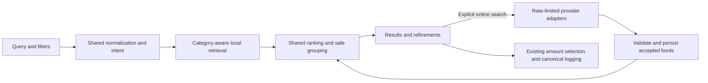

# Food Search Improvement Scope and Delivery Plan

**Status:** Implemented and locally validated; no production deployment performed. The final independent validation reached 87.5% top-three success, below the proposed 90% release target. Physical-device latency and screen-reader checks remain open. The diagnosis and estimates below record the original scope. See [implementation and validation](../../food-search-implementation.md), [development measurements](../../food-search-quality.md), and [final independent evaluation](../../food-search-validation-quality.md) for delivered behavior, evidence and remaining release gates.

**Goal:** Make the correct food easy to find when logging, especially when current results are missing, cluttered, or irrelevant. This is the user's stated priority; repeat-logging speed is secondary.

**Recommendation:** Improve retrieval, food-specific ranking, catalog descriptions, and result presentation together. Keep instant search local; offer an explicit online expansion for missing packaged products. Build on SQLite FTS5 and share query/ranking rules between native and hosted clients.

**Platforms:** Native iOS/Android, hosted web, and the Expo browser client. Apply the same search behavior to meal ingredients. Preserve offline native use, separate personal and catalog databases, current browser diary isolation, and authoritative nutrition calculations.

**Planning estimate:** 12–19 engineering days for the scoped release, including cross-platform validation, assuming one engineer familiar with the repository. Restaurant source repairs have the largest uncertainty. Broad catalog expansion is a separate follow-up. These are effort estimates, not a delivery commitment.

## Original diagnosis

The bundled catalog contains 50,322 foods: 7,793 USDA entries and 42,529 restaurant entries. Approximately 85% of the catalog is restaurant data. Native retrieval uses all-token prefix matching and FTS rank, then truncates at 101 candidates. The final API returns at most 100. Hosted retrieval uses substring matching and largely alphabetical ordering. Neither path has a shared food-specific relevance policy.

Read-only queries against `mobile/assets/catalog.sqlite`, reproducing the current native FTS query, showed:

| Query | Current catalog-only behavior | Desired behavior |
| --- | --- | --- |
| `egg` | First five results are Eggspectation names such as Eggcitement and Eggstravaganza. A standard raw whole egg ranks 120, outside the candidate limit. | Ordinary whole-egg choices lead; preparations remain clear. |
| `rice` | Rice cakes/crackers occupy the first five positions. A standard cooked white rice ranks 206. | Common rice choices appear early, with cooked/dry distinctions explicit. |
| `chicken breast` | Three Firehouse Subs entries with the same name lead. A standard roasted USDA breast ranks 54. | Generic unbreaded breast choices lead unless the query names a restaurant. |
| `mcdonalds` / `chickfila` | Zero matches. Punctuated/spaced equivalents find 165 / 378 entries. | Common spellings resolve to the intended chain. |
| `greek yoghurt` / `chikcen breast` | Zero matches; `greek yogurt` finds 57 entries. | Aliases and a bounded spelling correction recover relevant foods. |

These are catalog measurements, not live UI or production latency measurements. Online results and a user's lookup cache can change the displayed order.

There are also source-data problems. Firehouse Subs has three `Chicken Breast` entries with identical serving text but 320, 160, and 80 kcal. Cook Out has 12 entries named `Large`, including several with the same 24 oz serving label but different nutrition. These cannot safely be merged by name. They need source-backed descriptions or an explicit unresolved-data treatment.

Additional findings:

- Native name search waits for Open Food Facts, with a 10-second provider timeout. Hosted search waits for both providers, with a 5-second timeout, and writes their cache before querying stored foods. Existing local matches are not delivered independently.
- The two paths concatenate source results differently. Native online matches precede cached/catalog foods; hosted stored matches precede remaining provider matches. Relevance loses to source order.
- Source chips in both pickers are decorative. There are no functional category/restaurant filters, and the 100-result warning offers no continuation.
- Existing tests cover imports, nutrition, outages, and example lookups, but do not establish relevance across a judged query set. Both pickers already protect against stale asynchronous responses; preserve that behavior.

## Scope and alternatives

| Approach | Benefit | Limitation | Decision |
| --- | --- | --- | --- |
| Tune the current sort order | Small change and quick improvement for some queries | Cannot recover foods discarded before ranking, fix typo misses, or repair ambiguous records | Useful only as an early slice |
| Shared lexical retrieval/ranking plus catalog and UI improvements | Addresses the observed causes; works offline; uses the existing stack | Requires coordinated index, adapter, and UI work | Recommended |
| Add a hosted search service or semantic model | Could support a much larger online catalog and broader language matching | Adds service operations and an offline path; does not resolve missing or ambiguous source data | Reconsider only if the benchmark shows a remaining need |

The first release includes better matching/ranking, targeted restaurant-description repairs, useful filters and cards, real continuation, and explicit online fallback. Recents, favorites, multi-food baskets, meal-language parsing, photo recognition, and voice logging are follow-ups. Do not make those prerequisites for a relevance release.

## Proposed search behavior

### 1. Retrieve the right candidates before ranking

Use a shared normalization policy for queries and indexed fields: case folding, Unicode/diacritic handling, apostrophe and hyphen variants, whitespace, curated plurals, and controlled food/brand aliases. Examples include `yoghurt` ↔ `yogurt`, `mcdonalds` ↔ `McDonald's`, and `chickfila` ↔ `Chick-fil-A`. Avoid blanket stemming or substring expansion that makes `egg` behave like a strong match for `Eggspectation`.

Run exact/full-token and phrase retrieval first, prefix retrieval for partial input next, and spelling recovery only when exact coverage is weak. Start spelling recovery with one-edit/transposition candidates from the indexed vocabulary for tokens of at least five characters. Return the original query and proposed correction visibly; never replace it silently. Bound the vocabulary candidates and query expansions.

Preserve meaningful modifiers: raw/cooked, fried/grilled/breaded, plain/flavored, nonfat/full-fat, diet/zero/regular, sizes, and numerical fat percentages. A corrected or broadened match must not silently drop those constraints. For ambiguous broad queries, show distinct common preparations instead of guessing one preparation for logging.

Create independent candidate pools for generic foods, packaged products, restaurants, and custom foods. Retrieve exact-name/brand and curated staple matches directly in addition to FTS candidates, so a correct food cannot disappear behind restaurant matches. A starting budget is 100 candidates per active category per catalog; benchmark and tune it rather than treating it as a user-visible cap. Continuation fetches additional candidates from the filtered index, rather than merely paging an already truncated list.

Seed the hosted index with the approved USDA core already bundled on native; today the hosted path has only five built-in reference foods plus whatever live lookups have cached. Add missing core IDs through an idempotent import, preserving newer canonical records already stored under those IDs. A new hosted index alone would otherwise leave first-time generic searches dependent on online providers.

### 2. Rank by food intent, not provider order

The shared ranker should apply this order of precedence:

1. Explicit category/brand/restaurant filters and preparation constraints.
2. Query intent across categories: ordinary ingredient queries favor generic foods; a recognized restaurant plus item favors that chain; a branded product query favors matching packaged products. An exact restaurant item name must not automatically beat the appropriate generic interpretation.
3. Within the appropriate intent/category, exact names or reviewed aliases, complete token matches, and phrase matches; food-name matches outweigh incidental brand-prefix matches.
4. Source-backed description completeness and a small, reviewed common-food preference. This makes plain banana/rice/egg choices useful without overriding explicit modifiers.
5. Deterministic tie-breaking and diversity among similarly relevant results. Personal history can later be a bounded tie-breaker, not a way to override the requested food.

Use weighted FTS retrieval for candidate quality, then calculate shared relevance features from normalized metadata. Do not directly compare raw BM25 scores from separate catalog/cache databases, because those scores depend on each index's corpus.

Add a search category independent of `sourceKind`. In the current catalog, 31,950 restaurant entries have `sourceKind: database` because they came through Nutritionix. Some USDA descriptions also contain branded products. Category and provenance must be separate; derive classification from import/provider metadata with reviewed overrides rather than assuming every USDA row is generic or every database row is packaged.

Ranking metadata belongs beside the canonical `Food` data. Keep the existing food ID, source URL, nutrition basis, and values authoritative. A cleaned display label must retain meaningful preparation details and expose the original source description in details.

### 3. Make the result list useful

Replace static chips with **All / Generic / Packaged / Restaurants / Custom foods**, plus a relevant brand or restaurant refinement. On native, custom foods can be labeled **My foods**. On hosted web, retain **Community foods** for the shared custom catalog; do not accidentally promise private ownership. Saved meals remain in the existing My meals flow for this release.

Show food name, preparation/variant, brand or restaurant, serving/size, clearly labeled calories, and a concrete source label on each row. Secondary macro details can be quieter. Never mix a per-100g value with a per-serving label. Keep provenance details and source links available; a verified source is not proof that two listings are equivalent or that an ambiguous serving is usable.

Use a first page of approximately 20 useful results, with continuation. Deduplicate identical provider identities. Group variants only when a trustworthy product/menu family and distinguishing sizes/flavors are known. Expanding a family reveals the exact selectable records; the family header itself cannot be logged. Similar names or matching calories alone are insufficient evidence to merge records. Raw and cooked foods stay distinguishable.

For ambiguous imports, first recover missing item/size context from retained source material. If it cannot be recovered, keep the row addressable for existing references, clearly mark its missing detail, and avoid presenting it as a top recommendation or grouping it as an interchangeable variant. Do not invent the omitted product or serving size.

Keep query, filters, result list, and scroll position when returning from amount selection. Distinguish no exact matches, no matches under current filters, online search pending, unavailable online sources, and exhausted results. Offer a relevant action: accept a correction, clear a filter, search online, scan a barcode, or create a custom food.

### 4. Separate instant local discovery from online expansion

Use two independent search operations: local/indexed search as the user types, and explicit online search on a Search/Enter action or **Search online for …** button. Online progress must not block or clear local matches. Online results are labeled and combined through the same ranker; do not reshuffle a focused or selected row during interaction.

This is a provider constraint as well as a UX choice. Open Food Facts documents 10 search requests/minute/IP and explicitly discourages search-as-you-type. The hosted USDA adapter currently uses `DEMO_KEY`, whose published limits are 30 requests/hour and 50/day/IP. Add a server-only configurable USDA key and a clear unavailable-provider state when it is absent. Never embed that key in the native bundle. Native keeps its downloaded USDA catalog and direct, submitted OFF lookup.

Reuse the native adapter's existing `online=0` capability and extend hosted search to support it. New clients pass the mode explicitly; retain legacy default behavior during a documented transition. Add normalized-query result caching, in-flight request coalescing, bounded storage, provider-specific throttling, and 429 backoff. A local in-memory quota on one hosted instance is insufficient for shared upstream egress: use a shared quota mechanism for hosted OFF calls or keep that provider disabled there until one is available. Cache public provider results separately from any future personalized ordering.

Distinguish network failure, valid zero results, and products rejected for incomplete required nutrition. Reuse accepted products offline. Cache writes must be atomic; an online row should be loggable before selection is enabled. If persistence fails, retain local matches and report the save problem instead of replacing the entire search with an error. Changes to local data or catalog activation invalidate relevant query caches.

### 5. Fix coverage deliberately

Measure three different failures: an item exists but was not retrieved; it was retrieved but ranked poorly; it is absent or unusable in the data. Report them separately in the benchmark.

The native bundle has no general Open Food Facts packaged-product collection or barcode coverage in its seed. It also uses an April 2018 USDA SR Legacy snapshot. For the first release, improve discovery in that corpus, repair high-impact ambiguous imports, and make online/barcode expansion obvious. In parallel, evaluate a current USDA common-food refresh and a compact, explicitly scoped packaged-food supplement using the measured missing queries. Catalog refreshes need provenance, licensing, serving validation, download-size measurement, and build/update tests before inclusion. Do not promise every packaged product offline.

## Architecture and delivery map



Keep platform-specific rendering and storage adapters, with pure search rules shared. Extend the result contract with query identity, filter/category information, match/correction metadata, per-source status, and opaque continuation. Use a wrapper for search hits so recipes and diary nutrition do not become coupled to ranking fields. Define `hasMore` relative to the current query/filter/source scope; do not fabricate a total result count.

Use a bounded, ranked snapshot of the retrieved candidate window for each displayed search session. Bind its continuation to normalized query, filters, ranking version, catalog generation, and provider-result scope. Page through that fixed snapshot without duplicate or skipped IDs. Distinguish more pages in the snapshot from more candidates available upstream. Once its pages are exhausted, **Find more matches** can explicitly expand source/category candidate windows, create a larger reranked snapshot, and announce the refreshed list. This keeps deeper candidates reachable without pretending the initial bounded retrieval was globally exhaustive. Reject/reset incompatible cursors after catalog activation; changed caches or online results must not silently splice a second ordering into an existing cursor. Carry provider paging/exhaustion metadata through adapters instead of assuming their first 20 raw results are the full corpus.

| Work package | File map | Deliverable and acceptance | Effort |
| --- | --- | --- | --- |
| 1. Establish relevance baseline and catalog repair list | Create `tests/fixtures/food-search-relevance.json`, `scripts/food-search-benchmark.mjs`, and `docs/food-search-quality.md`; inspect `data/restaurant-foods/` and import scripts | A judged corpus, reproducible baseline, identified source defects, and explicit coverage misses | 1–2 days |
| 2. Shared retrieval and ranking | Extend `lib/food-search.ts`; create focused `lib/search/normalize.ts`, `aliases.ts`, `rank.ts`, and `metadata.ts`; update `mobile/src/catalog/queries.ts`, `mobile/src/catalog/lookup.ts`, `mobile/src/local/repository.ts`, `db/foods.ts`, and `scripts/food-catalog.mjs`; add a new hosted migration and USDA-core seed import | Exact/alias recovery, food-aware candidate retrieval, consistent ranking, stable continuation, hosted staple coverage, and no loss of installed/bundled fallback behavior | 4–6 days |
| 3. Local results and reliable online expansion | Update `app/api/foods/search/route.ts`, `lib/food-providers.ts`, `mobile/src/local/api.ts`, and `mobile/src/catalog/lookup.ts`; extract a focused provider cache/quota adapter; update server config/docs | Local results appear without a provider round trip; submitted online search respects quotas, deduplicates in-flight work, and degrades gracefully | 2–3 days |
| 4. Filters, result clarity, grouping, and targeted data fixes | Update `components/food-picker.tsx`, `mobile/src/screens/FoodPicker.tsx`, `app/globals.css`; add a shared `hooks/use-food-search.ts` and small platform result/refinement components; repair evidenced import records through new data revisions | Clear category/brand filters, recognizable variants, useful missing-result recovery, continuation, and preserved list state | 3–5 days |
| 5. Validate and roll out | Extend focused search/provider/catalog tests, `tests/e2e/tracker.spec.ts`, `tests/e2e/meals.spec.ts`, `mobile/tests/app.spec.ts`, and `mobile/tests/meals.spec.ts`; update README and food logging guide | Relevance gates pass on native/hosted adapters, physical-device latency is measured, migration/fallback behavior is verified | 2–3 days |

Sequence: package 1 establishes the labels and contract; packages 2 and 3 can then proceed in parallel against that contract. UI work can start with fixtures, but it must finish against real retrieval before sign-off. Source repair starts with package 1 and feeds package 4. Packages 1–3 provide an internal benchmark milestone; the user-facing release requires package 4's explicit online action, visible corrections, and continuation, followed by package 5 validation.

This is a scope and delivery plan. Detailed task-level implementation instructions should be written for each work package once its contract and data-repair findings are settled.

## Release gates

Build an initial 100-query corpus across five groups: generic staples, branded/restaurant searches, spelling/alias variations, preparation/size constraints, and recovery/coverage cases. Label acceptable food IDs/families and unacceptable substitutions. Keep related query variants together when dividing 60 development and 40 held-out cases; do not tune on the held-out subset.

Proposed acceptance targets, to be reported against the measured baseline:

- **Relevant results:** An acceptable result in the top three for at least 90% of answerable held-out queries and in the first 20 for at least 98% of answerable corpus queries; report each category separately. The `egg`, `rice`, `chicken breast`, restaurant spelling, and yoghurt regressions are explicit release blockers even if the overall score passes. Generic breast choices must lead for `chicken breast`; matching chain choices must lead for `Firehouse chicken breast`.
- **Candidate recall:** Before ranking/grouping, retrieve at least one labeled acceptable ID for at least 99% of answerable corpus queries, including all known staple/alias regressions. This gate diagnoses retrieval starvation separately from ranking. Report true missing-data cases separately, and require an actionable recovery path for them. Pagination/explicit candidate expansion must reach labeled items beyond the old 100-result cutoff without duplicate or skipped IDs within a snapshot.
- **Correct distinctions:** All protected-modifier cases preserve the requested preparation, flavor, size, and nutrition basis. No logging from a variant-family header; no name-only merging of the ambiguous Firehouse/Cook Out fixtures.
- **Responsiveness and resilience:** Target native local first results within 250 ms p95 after input settles, including debounce, on a recorded representative device. Measure cold and warm searches separately. Hosted indexed response target is 300 ms p95 excluding client network transit. Provider delays, 429s, offline mode, and cache-write failures must leave usable local results selectable. These are targets, not measurements obtained during this audit.
- **Flow and accessibility:** Filters, corrections, retry, continuation, and variants work with keyboard and screen reader, on narrow screens and in ingredient selection. Back restores the list; stale responses never replace a newer query; repeated taps cannot double-log.

Use deterministic provider fixtures in CI. Test the actual catalog and hosted FTS adapter in integration tests rather than relying solely on mocked UI responses. Include broad queries, accents/apostrophes/hyphens, punctuation-only input, two-character prefixes, explicit brands, reordered words, long input, installed/bundled duplicate IDs, provider-only synonym matches, and incomplete nutrition.

The existing checks remain relevant: focused Vitest search/catalog/provider suites, web and Expo browser Playwright flows, root and mobile type checks/lint, and compiled Worker smoke validation. Native SQLite and performance behavior also require an iOS/Android device or simulator check; browser tests cannot establish that.

## Migration and rollout constraints

- **Catalog compatibility:** Current manifests and validators accept schema version 1 only. Prefer an additive search-metadata/index extension while retaining the existing tables and version-1 read behavior; feature-detect it and support older downloaded catalogs. If an incompatible schema is needed, update manifest validation, updater, builder, bundle, and compatibility tests together and use a versioned distribution path. Do not publish a catalog older clients cannot consume on their existing feed.
- **Existing lookup caches:** Add a versioned, idempotent backfill for cached product search metadata and indexes. `CREATE TABLE IF NOT EXISTS` does not update existing schemas. Preserve cached products/barcodes and keep search usable during rebuild; test restart halfway through migration. For older read-only catalogs, use a compatible fallback or a rebuildable sidecar index keyed to catalog generation, without altering the signed database bytes.
- **Hosted migration:** Add a new FTS/metadata migration and backfill; do not rewrite deployed catalog migrations. Maintain the search index atomically on imports/custom-food/provider writes. Test D1/Worker behavior and the database export/recovery path with FTS tables before rollout.
- **Authoritative identity:** Preserve food IDs and historical diary snapshots across description repairs. Resolve selected foods through the existing canonical logging path. An online cache refresh or catalog activation cannot silently change an already reviewed portion; pin the selected record version or require refreshed review before save.
- **Privacy:** The current analytics sanitizer intentionally strips all event properties and excludes queries/food details. Evaluate relevance with synthetic fixtures and local diagnostics first. Do not upload search strings, food IDs, history, or introduce new telemetry fields as incidental work. Hosted shared provider caches must not contain personalized ordering or diary data.
- **Rollback:** Gate new ranking/presentation independently of additive storage changes. Keep the older compatible index/read path during rollout, preserve signed catalog fallback, and verify interruption/restart does not leave either index half-built. Preserve new data corrections where valid; rollback must not restore ambiguous nutrition by rewriting diary entries.

## Deferred follow-ups

After the relevance release, assess recents/favorites and last-used portions, multi-food logging, and saved-meal discovery. Personalization needs device-local/native storage, browser-diary-scoped hosted storage, and backup/restore support if new persistent preferences are introduced.

A supporting issue found during inspection is that changing units in either add picker resets quantity to one serving. Address it as a small separate correctness fix with an invariant test: two 40 g servings must remain 80 g when changing units. Keep it out of the relevance milestone's critical path.

## Evidence and external constraints

Repository anchors: `mobile/src/catalog/queries.ts` (FTS and cap), `mobile/src/catalog/lookup.ts` (merge order/online timeout), `mobile/src/local/repository.ts` (custom-food matching/final cap), `mobile/src/local/api.ts` (online default), `db/foods.ts` (hosted substring ordering), `app/api/foods/search/route.ts` (provider gating), both FoodPicker components (flat results/static chips), `scripts/food-catalog.mjs` and `data/food-catalog/README.md` (corpus/format), and `mobile/src/analytics/events.ts` (privacy allowlist).

- [SQLite FTS5 documentation](https://www.sqlite.org/fts5.html): prefix indexes, weighted BM25, and indexed vocabulary support are available building blocks; they do not supply food-specific typo/intent behavior by themselves.
- [Cloudflare D1 supported SQL/extensions](https://developers.cloudflare.com/d1/sql-api/sql-statements/): D1 supports FTS5, including `fts5vocab`; validate the exact migration and recovery operations in the deployed runtime.
- [Open Food Facts API guidance](https://github.com/openfoodfacts/openfoodfacts-server/blob/main/docs/api/index.md): current search rate limits and guidance against search-as-you-type, checked during this audit.
- [USDA API guide](https://fdc.nal.usda.gov/api-guide/): current demo-key limits and server key responsibility, checked during this audit.

To reproduce the native catalog ordering without modifying the database:

```python
import json, re, sqlite3
db = sqlite3.connect('file:mobile/assets/catalog.sqlite?mode=ro', uri=True)
query = 'egg'
terms = re.findall(r'[^\W_]+', query)[:10]  # Equivalent for these audit examples.
match = ' AND '.join('"' + term + '"*' for term in terms)
rows = db.execute('''
  SELECT f.food FROM food_search s JOIN foods f ON f.id=s.id
  WHERE food_search MATCH ? ORDER BY rank,f.name LIMIT 101
''', (match,))
for position, (value,) in enumerate(rows, 1):
    food = json.loads(value)
    print(position, food['id'], food['name'], food.get('brand', ''))
```
